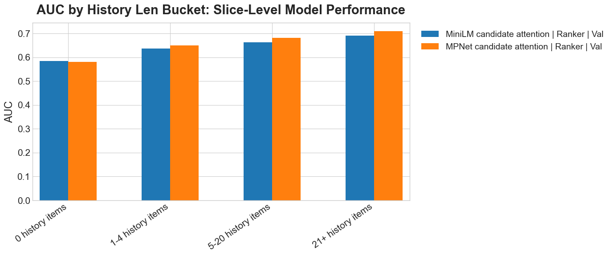
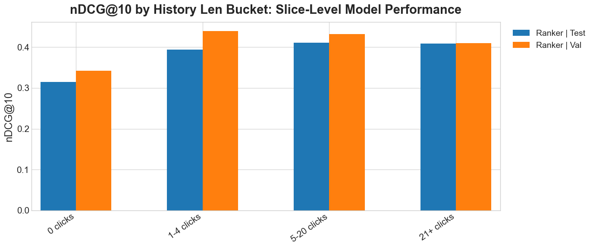
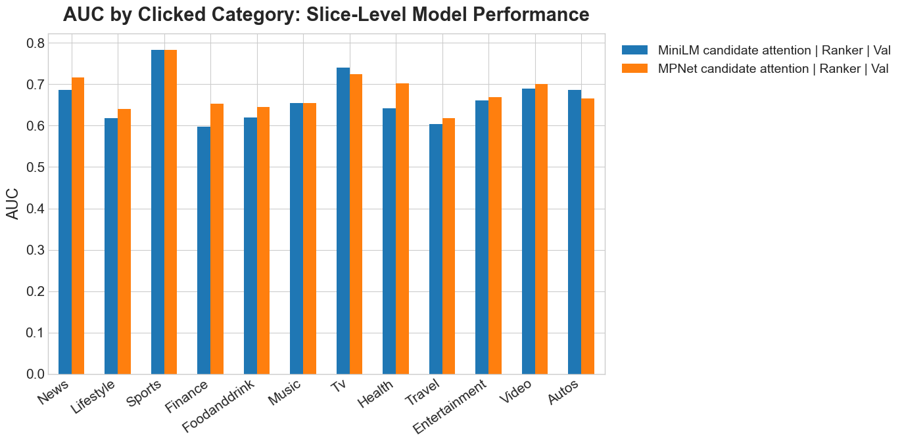
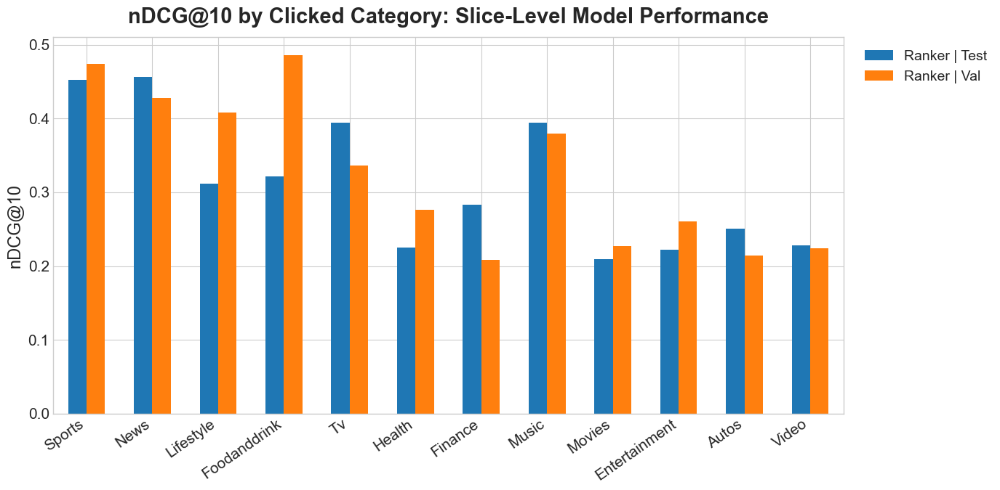
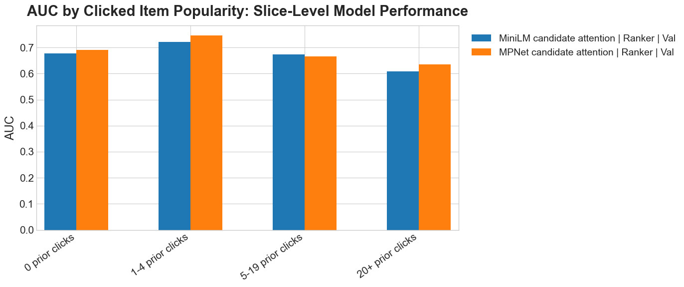
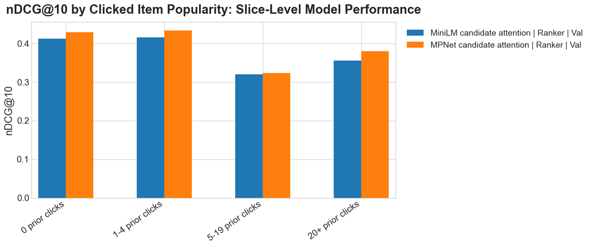
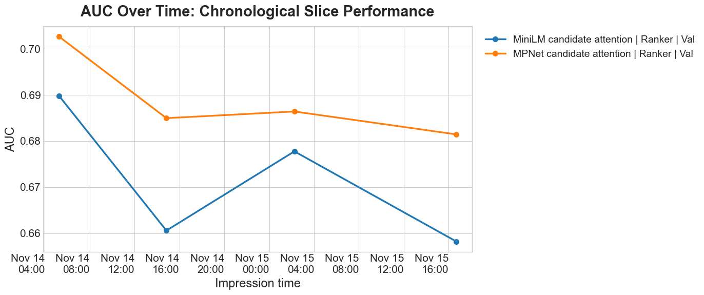
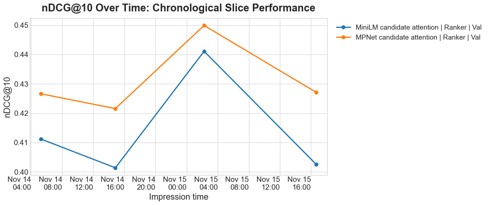
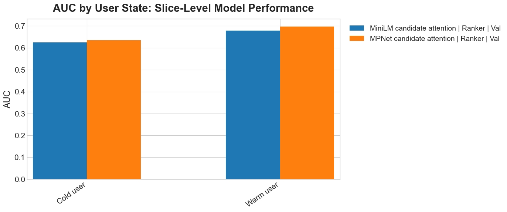
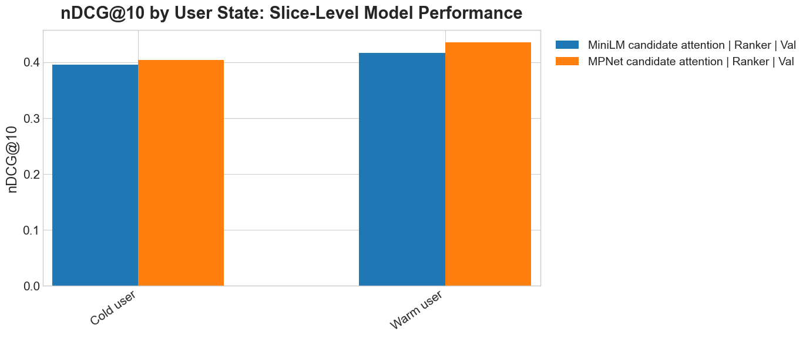

# MIND Multi-Stage News Recommender (Retrieval -> DLRM+Knowledge_Graph Ranker; Optional Re-ranker)

This project implements a realistic recommender stack on the **Microsoft News Dataset (MIND)**:
- Preprocessing: prepare train/val/test data, click-count features, cold/new flags, impression-level eval data, and map IDs to indices.
- Train **Teacher retrieval encoders** (text-based item encoder + history-based user encoder).
- Build two Faiss ANN retrieval indexes: (1) for item embeddings from teacher, and (2) for item-base features. These indexes are used for hybrid candidate retrieval.
- Train **Student ranker**, a lean DLRM-style sparse+dense model that narrows **hybrid retrieval** returned `topk` items to more relevant `pool_size` items. Alongside the usual DLRM-style ID embeddings, category/subcategory embeddings, and dense features, this student uses semantic and **Knowledge Graph embeddings**: it encodes the candidate's text-plus-KG item-base embedding and pools the clicked-history text-plus-KG item-base embeddings. Teacher **distillation** (logit + representation) from the text/history-based teacher helps those semantic branches learn a stronger user/item matching space than click labels alone, **improving cold user/item behavior where ID memorization is weak**.
- An **optional post-ranking layer** supports diversity, coverage, and exposure-fairness experiments. It is isolated from the competition submission path.
- Re-ranking utilities can search weights and penalties under configurable product guardrails, then report the selected trade-off on held-out test data.
- Extensive **evaluation**: ranking metrics, calibration, diversity, exposure fairness, and cold/new slices.

👉 For production recommendations:

The system has three inference steps for each user/impression.

1. Retrieval narrows the full catalog (potentially thousands or millions of items) to `topk=200` candidates.
2. The student ranker scores those candidates and keeps the top `pool_size=50` candidates.
3. The reranker takes that pool and produces the final `k_out=10` items.

👉 For MIND competition submission:

1. No retrieval is needed at submission time because each test impression already provides a small candidate set. The trained teacher retriever is still used to supervise the student ranker's training.
2. The student ranker scores and ranks every candidate supplied in each test impression. It does not truncate the candidate set because the submission must contain all candidates.
3. Reranking is not needed for the competition.

MIND is widely used as a benchmark for news recommendation, with impression logs and rich news metadata.

Production design note: if a fresh batch of news arrives, for example from the last 15 minutes, the system would need fresh item-side representations. For each new article:
- Run the sentence-transformer over text/title/abstract to produce the text-only retrieval `item_base` embedding.
- Pass the text-only `item_base` through the teacher item encoder to produce `item_teacher_emb`.
- Parse linked Wikidata entities and aggregate entity/relation/one-hop context features to produce the KG-enhanced `item_ranker_base` embedding.
- Mark as cold/new with `is_new_item = 1`, `item_clicks_log1p = 0`.
- Add to both Faiss retrieval indexes: the teacher index (`item_teacher_emb`) and the text-only fallback index (`item_base`).

The current repo/CLI does not implement online index updates; it builds and writes both Faiss indexes in batch via `build_index`.

## Teacher model
- The teacher is a learned two-tower retrieval model:
  - a **news/item encoder** that starts from frozen sentence-transformer news embeddings and applies a trainable projection
  - a **user encoder** that attention-pools clicked-history item embeddings (before the current impression) into a user vector
- In the `behaviors.tsv` dataset, `history` is a list of previously clicked news IDs for that user before the current impression time. It is not a list of previous impressions.
- Training uses clicked positives plus in-impression negatives.
- Retrieval evaluation encodes each validation/test impression with that impression's own user history (not from some later history for the same user), so the query is temporally aligned with the impression being scored.
- `encode_user_from_item_vectors(history_z, mask)` expects:
  - `history_z`: shape `[B, T, D]` where `B` is batch size, `T` is history length, and `D` is the teacher hidden dimension
  - `mask`: shape `[B, T]` with `True` for valid history positions and `False` for padding
  - output: shape `[B, D]`
- Item embedding path:
  - `item_proj`
  - `normalize`
- User embedding path:
  - `item_proj` on each clicked history item
  - `normalize` on each clicked history item
  - `HistoryAttentionPool` (`MultiheadAttention` + learned query)
  - `normalize` on the pooled user vector
- The learned query vector in `HistoryAttentionPool` is a trainable vector used to emphasize certain click history over other click history. This query vector is global, not per-user.
- During teacher training, the trainable parts are:
  - `item_proj`
  - the multi-head attention parameters inside `HistoryAttentionPool`
  - the learned query vector
- The training objective pushes each user vector closer to its clicked positive item and farther from sampled in-impression negatives and other in-batch positives.
- At the end of `train_teacher`, the pipeline writes:
  - `item_base_emb.npy`: frozen text-only sentence-transformer feature for every news item, used by teacher training and retrieval.
  - `item_ranker_base_emb.npy`: separate `[sentence-transformer text embedding ; KG entity/context embedding]` feature used by the student ranker
  - `item_teacher_emb.npy`: the final teacher embedding for every news item
  - `user_teacher_emb.npy`: a cached teacher embedding for each training user history, retained as an artifact for inspection/backward compatibility
- These files are then reused by later stages:
  - `build_index` builds the Faiss retrieval index from `item_teacher_emb.npy`
  - `eval_retrieval` uses `item_teacher_emb.npy` and the saved teacher model to encode held-out histories and search that index
  - `train_ranker` loads `item_ranker_base_emb.npy` as student semantic input and `item_teacher_emb.npy` as item supervision. It does **not** consume `user_teacher_emb.npy`; instead, it dynamically encodes each pair's impression-time history with the saved teacher model.

## Hybrid retrieval scoring

During `eval_retrieval`, the teacher retrieval query is built by taking the impression's clicked history news, looking up their teacher item embeddings, and passing those vectors through `TeacherTwoTower.encode_user_from_item_vectors()`.
The base retrieval query is built by averaging the impression's clicked history news' raw sentence-transformer `item_base_emb.npy` embeddings.

Faiss returns scalar similarity scores:
- `teacher_score`: similarity between the teacher user query and a candidate `item_teacher_emb.npy` vector
- `base_score`: similarity between the averaged of the clicked-history text-only `item_base_emb.npy` vectors and a candidate `item_base_emb.npy` vector

The retrieval code searches both Faiss indexes, merges the oversampled candidate lists, and keeps the final `topk` items by hybrid score. (`hybrid_oversample` controls how many candidates are fetched from each index before the merge.) With the current config, candidates are ranked mostly by teacher retrieval with a small text-only semantic contribution. KG is intentionally not used during retrieval.
```text
hybrid_score = (1 - retrieval.hybrid_base_weight) * teacher_score
             + retrieval.hybrid_base_weight * base_score
```

Retrieval evaluation currently skips users with no history.

History-length slices show how much the retrieval and ranking stages depend on having enough prior clicks to describe the user:





## Student model

The student keeps a lighter semantic core than the teacher, but combines it with classic DLRM signals:
- projected `user_id` / `news_id` branches
- category and subcategory embeddings
- lightweight dense features
- DLRM-style feature interactions

#### DLRM-style semantic additions
- A classic DLRM usually combines sparse ID/category embeddings, dense numerical features, pairwise feature interactions, and a final top MLP. It usually does not include item text embeddings or user-history semantic embeddings directly; those are project-specific additions here.
- In `DLRMStudent`, the candidate item's `item_ranker_base_emb.npy` vector is formed by concatenating its sentence-transformer text embedding with a KG feature vector. That KG vector aggregates the article's linked entity embeddings together with relation-aware one-hop neighbor context from the configured triples file. The candidate item's vector is projected into `item_sem`, and the corresponding clicked-history vectors are pooled/projected into `user_sem`. Both are mapped to the same `emb_dim` length as the other DLRM feature vectors. `ranker.dlrm.history_pooling` selects the original candidate-independent `mean` or the opt-in `candidate_attention` path, where the current candidate queries the clicked-history states before `user_sem` is formed.
- These semantic vectors, plus `sem_fused`, are added to the DLRM feature list as extra feature vectors. They are then included in the pairwise dot-product interaction layer and concatenated into the final top MLP input.

#### Distillation representation
- In `DLRMStudent.forward()`, the student representation used for distillation is `rep = [user_sem, item_sem, sem_fused]`.
- `user_sem`: student semantic user vector from pooled click-history KG-enhanced item-base features
- `item_sem`: student semantic item vector from the candidate item's KG-enhanced item-base feature
- `sem_fused`: a lightweight attention-fusion summary that mixes the semantic user/item states with the structured query context
- The teacher target is `concat(teacher_user_emb, teacher_item_emb)`. A projection head maps the student representation into the teacher space for representation distillation.
- The teacher is semantic/history-based rather than mostly `user_id`/`news_id` memorization. Representation distillation therefore **encourages the student's semantic branch to learn a useful user/item space, especially when ID signals are weak for cold users or new items**.
- If the ranker were trained without distillation, its loss would reduce to the supervised click-label objective:
```python
loss = binary_cross_entropy_with_logits(student_logits, click_label)
```
- Without distillation, retrieval can still be designed in two ways:
  - Use only the frozen text-only `item_base_emb.npy` sentence-transformer embeddings for retrieval
  - Train a retrieval model, but do not use that model as a teacher to supervise the ranker

#### Teacher -> student distillation map
- Distillation in this project is not copying the teacher into a smaller clone.
- The student is trained to imitate the teacher's semantic user/item representations and semantic matching behavior, while still having its additional features.

| Teacher block | What it does | Student replacement | Key difference |
|---|---|---|---|
| Frozen text-only item-base input | Base text semantics for each news item | KG-enhanced `item_ranker_base_emb.npy` input | Retrieval stays text-only; the ranker receives extra entity/relation/neighbor context |
| Teacher semantic item encoder | Refines each item into the teacher semantic space | Smaller student semantic item encoder | Student semantic dimension is much smaller than the teacher space |
| Teacher sequence-aware user encoder | Contextualizes clicked history items with attention before pooling | Cheaper history aggregation path | Student uses a lighter history refinement and aggregation path |
| Teacher attention pooling over history | Builds one semantic user vector from clicked history | Mean pooling by default; optional candidate-aware multi-head attention | Candidate-aware pooling recomputes `user_sem` for each candidate |
| Teacher item embedding | Semantic representation of the candidate item | `item_sem` | Student item representation is trained to approximate teacher behavior |
| Teacher user embedding | Semantic representation of the current user history | `user_sem` | Student user representation is cheaper to compute |
| Teacher cosine-style user-item scorer | Measures semantic compatibility between user and item | Student top MLP ranker | Student scoring uses richer ranking signals beyond pure semantic similarity |
| Teacher representation target | Provides a semantic supervision target for distillation | `rep = [user_sem, item_sem, sem_fused]` plus projection head | Student and teacher representations have different shapes and meanings |
| No direct teacher counterpart | None | `sem_fused` | Student adds an attention-fusion summary conditioned on query context |
| No direct teacher counterpart | None | `user_id` / `news_id` branches | Student adds collaborative-style memorization signals |
| No direct teacher counterpart | None | category / subcategory embeddings | Student adds structured metadata signals |
| No direct teacher counterpart | None | dense features such as `history_len` and `item_clicks_log1p` | Student adds non-semantic ranking features |
| No direct teacher counterpart | None | DLRM interaction terms + top MLP | Student is a broader ranker, not just a semantic retriever |

Category and clicked-item-popularity slices help check whether the model is robust across content verticals and between new, low-click, and high-click items:









#### Where the student ranker is simplified
- teacher semantic item encoder -> smaller student semantic item encoder
- teacher sequence-aware user encoder -> cheaper history aggregation path
- teacher cosine scorer -> student MLP ranker with many extra inputs

## Re-ranking (Optional; not used by the competition submission)

- The focused workflow and configuration reference live in
  [docs/reranking.md](docs/reranking.md); this section is only a conceptual overview.
- In this project, re-ranking is a **deterministic optimization layer** on top of ranker scores.
- It is controlled by hyperparameters/constraints (relevance, novelty, coverage, fairness).
- **No training loop is required** for this re-ranking stage.
- `rerank_search` uses the "Nov 14" data to choose an operating point; `rerank_eval` reports that selected setting on the "Nov 15" data (Large Temporal Val is Nov 14 + 15. See the dataset timeline below.)
- Both commands first obtain the ordinary student-ranker scores and then apply
  the optional greedy reranker. The reranker experiment does not replace or
  retrain the student model.

#### Re-ranking process

- `greedy_rerank()` takes the top `pool_size` candidates by ranker score, then builds the final top-`k_out` list one item at a time.
- With the recommended `relevance_normalization: minmax`, ranker logits inside each pool are mapped to `[0, 1]`. This keeps relevance, novelty, and coverage weights interpretable when ranker checkpoints have different logit scales. Set it to `none` only to reproduce legacy raw-logit experiments.
- At each step it scores every remaining candidate with:
- `relevance_weight * relevance`
- `+ novelty_weight * novelty`
- `+ coverage_weight * coverage`
- `- fairness.penalty_weight * fairness_penalty`
- It then picks the candidate with the highest total value, adds it to the list, updates the running novelty/coverage/fairness state, and repeats until `k_out` items are selected.

#### Exposure fairness

- Let `p` be the **actual exposure distribution** of the current ranked list across groups such as categories.
- Let `q` be the **target distribution** we want to match.
- In the current code:
- `p` is built from the selected top-K list after applying position weights.
- `q` is derived from the reference candidate set:
  - `fairness_kl_pool` compares top-K exposure against the reranker's top-`pool_size` candidate mix.
  - `fairness_kl_full` compares top-K exposure against the full impression candidate set.
  - If `category_target: uniform`, then `q` is uniform over categories present in the reference set (not used in this project).
  - If `category_target: catalog`, then `q` is the category distribution of the impression candidate pool (the candidates available for that user/impression), not the selected top-K list and not the global corpus-wide catalog.
- `rerank_eval` and `rerank_search` report both `fairness_kl_pool` and `fairness_kl_full`. Fairness Gini includes zero-exposure categories present in the pool target.
- Product constraints in reranker search use `fairness_kl_pool`, because that matches the reranker's actual optimization target.

#### Worked examples for novelty, coverage, and fairness

These examples use the current scoring definitions. The numbers are
illustrative; the active weights and constraints come from the experiment
config.

- Suppose the reranker has already selected two items: `A` and `B`.
- Candidate `C` has ranker relevance score `0.80`, category `Sports`, entities `{Messi, Inter Miami}`, and is marked as a new item.
- Candidate `D` has relevance score `0.78`, category `Health`, entities `{WHO, vaccine, pandemic, hospital}`, and is not new.

- **Novelty example with `teacher_cosine`**:
  - If `C` has teacher-embedding cosine similarities `0.90` to `A` and `0.35` to `B`, then `novelty(C) = -max(0.90, 0.35) = -0.90`.
  - If `D` has similarities `0.20` to `A` and `0.10` to `B`, then `novelty(D) = -0.20`.
  - Because `-0.20 > -0.90`, `D` is treated as more novel than `C`.

- **Coverage example**:
  - Suppose the selected list has already covered categories `{Sports, Politics}` and entities `{Messi, Real Madrid}`.
  - If `coverage.category_bonus = 1.0`, `coverage.entity_bonus = 0.3`, and `max_new_entities_per_item = 3`:
  - `C` is in `Sports`, which is already covered, so it gets no category bonus. It adds one new entity, `Inter Miami`, so `coverage(C) = 0.3`.
  - `D` is in `Health`, which is new, so it gets `1.0` category bonus. Its four entities are all new, but only the first `max_new_entities_per_item = 3` new entities can contribute, so its entity bonus is `3 * 0.3 = 0.9` and `coverage(D) = 1.9`.

- **Exposure fairness example**:
  - Suppose the current top-3 list has categories `[Sports, Sports, Health]`.
  - With log position weights, a typical exposure pattern is roughly `[1.00, 0.63, 0.50]`.
  - Then the actual category exposure map is:
  - `Sports: 1.00 + 0.63 = 1.63`
  - `Health: 0.50`
  - After normalization, this becomes approximately `p = {Sports: 0.765, Health: 0.235}`.
  - If the reference candidate pool category mix is `Sports: 50%`, `Health: 30%`, `Politics: 20%`, that normalized mix is `q`.
  - While choosing each next item, the reranker computes the prospective penalty as `0.5 * KL(p || q) + 0.5 * L1(p, q)`. The reported fairness metrics are calculated separately after the list is complete.

- **New-item exposure penalty example**:
  - Suppose `new_item_floor = 0.20`.
  - If only the rank-3 item is new, then new-item exposure is `0.50`.
  - Total exposure is `1.00 + 0.63 + 0.50 = 2.13`.
  - So `new_item_exposure_frac = 0.50 / 2.13 = 0.235`, which is above the floor, so no extra penalty is added.
  - If no selected item is new, then `new_item_exposure_frac = 0.0`; the prospective fairness penalty receives an additional `2 * (0.20 - 0.0) = 0.40` before the configured global fairness-penalty weight is applied.

## Evaluation
- **Ranking quality**: AUC, MRR, nDCG@K, MAP@K, Recall@K
- **Calibration**: ECE (expected calibration error), Brier score
- **Diversity**: intra-list diversity (ILD), category coverage@K, category entropy@K
- **Exposure fairness**: position-weighted exposure, disparity vs target distribution (KL / L1 / Gini), new-item exposure floor

The official MIND leaderboard reports `AUC`, `MRR`, `nDCG@5`, and `nDCG@10` (see each `ranker_eval_*.json`). The official leaderboard uses the full/large hidden test set. Local metrics are split-dependent, so compare runs only when they use the same validation protocol.

The split protocols and current result locations are tracked in [docs/experiment_registry.md](docs/experiment_registry.md). Check that registry before comparing metrics across runs.

# Quickstart

## 0) Hardware target

This repo is designed to run on a powerful Windows laptop:
- trains and scores the neural models on a CUDA GPU through PyTorch
- uses **faiss-cpu only for ANN index construction and search**; this avoids a
  separate GPU-Faiss dependency and does not imply that model training runs on CPU
- uses the promoted MPNet text backbone with memory-bounded encoding,
  mixed-precision adaptation, and cached item representations
- supports full MIND-large processing plus optional config-driven subsampling

---

## 1) Setup (Windows)

```bash
python -m venv .venv
.venv\Scripts\activate
pip install -r requirements.txt
```

---

## 2) Get the dataset (MIND)

Place files under:
```
data/raw/MINDlarge_train/
data/raw/MINDlarge_dev/
data/raw/MINDlarge_test/
```
Each folder should contain its MIND `behaviors.tsv` and `news.tsv` files. The
hidden-test behaviors have no click labels. The reranker may use the entity
annotation columns already present in `news.tsv` for coverage when
`rerank.coverage.entity_bonus > 0`.
When `knowledge_graph.enabled: true`, the model also needs to use `entity_embedding.vec` and `relation_embedding.vec`.

---

### 2.1) Quick terminology: entities in MIND

- In MIND, an **entity** is a named entity extracted from a news article (person, organization, location, etc.) and linked to a knowledge graph (the MIND paper references Wikidata).
- `entity_embedding.vec`: embedding vector for each entity ID.
- `relation_embedding.vec`: embedding vector for each relation type between entities.
- `WikidataId` is the bridge between `news.tsv` and `entity_embedding.vec`. During the `train_teacher` command, if an article's title or abstract entity annotation contains a `WikidataId`, the KG feature builder looks up the row with that ID in `entity_embedding.vec`.
- A **knowledge-graph triple** is a directed fact written as `(head entity, relation, tail entity)`. For example, `(Q76, P31, Q5)` means that entity `Q76` has relation `P31` to entity `Q5`. In a one-hop lookup, an entity mentioned by an article is the head or tail of a triple, and the entity at the other end is its neighbor.

The implemented approach follows the classic KG recommendation pattern:
- Parse linked `WikidataId` values from each article's title/abstract entity columns.
- Fetch those entity vectors from `entity_embedding.vec`.
- Fetch one-hop neighbors from the required triples file using triples `(entity, relation, entity)`, combine neighbor entity vectors with the relation vector from `relation_embedding.vec`, and aggregate the messages into a context vector.
- Concatenate the final KG vector with the sentence-transformer text vector to form `item_ranker_base_emb.npy`.
- Feed this KG-enhanced item base into the student ranker.

#### Building a triples file

A triples file we can use is **Wikidata5M**, a compact Wikidata-derived KG with the exact ID style this project needs: entities use `Q...`, relations use `P...`, and triples are stored as rows like `Q22686 P39 Q11696`. It is not guaranteed to be the exact MIND TransE training subgraph, but it is a reasonable Wikidata subgraph for one-hop neighbor expansion.

Download one of the Wikidata5M KG files from:
- https://deepgraphlearning.github.io/project/wikidata5m

Then filter it down to MIND-mentioned entities:

```powershell
python scripts/build_mind_wikidata5m_triples.py `
  --kg-path data/raw/wikidata5m/wikidata5m_transductive_train.txt `
  --raw-root data/raw `
  --train-dir MINDlarge_train `
  --dev-dir MINDlarge_dev `
  --entity-embedding data/raw/MINDlarge_train/entity_embedding.vec `
  --entity-embedding data/raw/MINDlarge_dev/entity_embedding.vec `
  --entity-embedding data/raw/MINDlarge_test/entity_embedding.vec `
  --relation-embedding data/raw/MINDlarge_train/relation_embedding.vec `
  --relation-embedding data/raw/MINDlarge_dev/relation_embedding.vec `
  --relation-embedding data/raw/MINDlarge_test/relation_embedding.vec `
  --output data/processed/MINDlarge/kg_triples.tsv
```

How this repo uses MIND entity annotations:
- `news.tsv` contains `title_entities` and `abstract_entities` columns.
- During greedy reranking, the reranker tracks covered entities for the entity coverage bonus.
- Reranker entity coverage is separate from the neural KG feature path: coverage decides list diversity, while KG features affect the learned ranker representation.

The accepted design is **text-only retrieval plus a KG-enhanced ranker**. Rejected
retrieval variants are recorded in the
[experiment registry](docs/experiment_registry.md#rejected-historical-retrieval-experiments).

---

### 2.2) What `run_preprocess()` does

`run_preprocess()` converts raw MIND TSV files into model-ready parquet/json files.

Main steps for Large temporal configs such as
`configs/mind_large_temporal_mpnet.yaml`:
- Read `news.tsv` and `behaviors.tsv` from train/dev.
- Build ID mappings (`user_id/news_id/category/subcategory -> integer index`).
- Move the final day of `train_dir` into validation, then append all of `dev_dir` to that same validation split.
- Build reproducible random training/validation pairs. The random training pairs
  are kept because the same processed dataset supports the random-negative
  baseline; the promoted hard-negative ranker instead constructs temporary
  examples from grouped behaviors when ranker training begins.
- Build impression-level validation data plus separate chronological views for
  reranker tuning and reporting.

How pairs are created:

- For an impression with `P` positives and `N` negatives, `P * (1 + min(data.ranker_negatives_per_positive, N))` pairs are generated.
- Each positive is paired with up to `data.ranker_negatives_per_positive` sampled negatives; the current config uses `4`.
- These negatives are labeled non-clicked candidates from the same impression. This is the fallback ranker pair-building behavior when hard-negative sampling is disabled.

#### Negative selection by training stage

- **Text adaptation (Phases 1 and 3):** samples are generated lazily each
  epoch. For a cold user with usable history, a frozen snapshot of the text
  encoder at the start of that phase scores a random pool of up to 20
  same-impression negatives; one hard and three random negatives are retained.
  Phase 1 uses the base backbone snapshot, while Phase 3 uses the selected
  Phase 1 checkpoint. Warm users receive four random negatives, and impressions
  without usable history are omitted because the adaptation objective requires
  a history representation.
- **Teacher training:** this is independent of the hard-negative machinery. It
  randomly samples up to eight non-clicked candidates from the same impression
  for each positive and also uses in-batch positives as contrastive negatives.
- **Student-ranker training (Phases 2 and 3):** before ranker optimization, the
  frozen trained teacher scores a random same-impression pool of up to 20. Cold
  users with 1–4 usable history items retain one teacher-hard and three random
  negatives; warm and zero-history users retain four random negatives. These
  temporary rows are built from grouped training behaviors, independently of
  the retained baseline `train_pairs.parquet` artifact.
- To avoid teacher/student label conflict, teacher-hard candidates are selected
  only from negatives that the teacher scores no higher than the clicked
  positive in the same impression. Ranker distillation is disabled on those
  teacher-mined rows by default. Text adaptation applies the analogous
  positive-consistency filter using its frozen encoder snapshot.

Why there is no `train_impressions.parquet`:
- Ranker training uses pairwise rows, either persisted in `train_pairs.parquet` for random sampling or built dynamically from `train_behaviors.parquet` for hard mining.
- Impression-grouped data is mainly needed for ranking evaluation. Temporal-tune
  configs generate combined `val`; Large temporal configs additionally generate
  reranker-only `rerank_tune` and `rerank_test` views.

#### Large data timeline

| Calendar window | Raw source | Role during model selection | Reranker role | Impressions |
| --- | --- | --- | --- | ---: |
| Nov 9–13 | `MINDlarge_train` before the cutoff | Large Temporal Train | Not used | 1,801,231 |
| Nov 14 | Tail of `MINDlarge_train` | Part of Large Temporal Val | Tune priorities and policy | 431,517 |
| Nov 15 | `MINDlarge_dev` | Part of Large Temporal Val | One-time frozen-policy report | 376,471 |
| Nov 16–22 | `MINDlarge_test` | Hidden competition test; labels unavailable | Not used | 2,370,727 |

Large Temporal Val therefore contains 807,988 impressions across the middle two
rows. Upstream encoder, teacher, and ranker selection used that combined
validation set. The reranker later reused it as two chronological views, so its
reporting day is independent of reranker tuning but not independent of earlier
upstream model development.

In Phase 3, the selected encoder continues on Large Temporal Val, and the
teacher/ranker fit uses all labeled Train + Dev impressions. Hidden Test click
labels are never available or used.

Evaluation also divides each holdout into chronological `time_period__...`
slices so regressions can be checked against impression order:





---

## 3) End-to-end Large MPNet workflow

The promoted workflow first selects the model on the chronological Large
temporal split, then performs a maximum-data fit for the hidden leaderboard
test. Run one phase at a time so each selection decision can be reviewed before
the next phase consumes more data.

### 3.1 Prepare Large temporal data

After placing the Large raw files and building the KG triples described above,
run:

```powershell
python -m mindrec.cli preprocess --config configs/mind_large_temporal_mpnet.yaml
```

This creates the training, validation, and reranker views shown in the timeline
above. The promoted phase runner performs this step automatically when the
compatible processed data is not already present.

### 3.2 Phase 1: select the adapted MPNet checkpoint

```powershell
.\scripts\run_mpnet_backbone.ps1 -Phase phase1
```

Phase 1 adapts `all-mpnet-base-v2` on Large Temporal Train for at most 10,000
successful optimizer updates. Every 1,000 updates it evaluates the text
objective on Large Temporal Val; early stopping selected update 9,000. This
phase selects only the text encoder—it does not yet train the final two-tower
teacher or student ranker.

For each training impression, MPNet encodes every article as
`title [SEP] abstract`; the mean of up to 10 clicked-history embeddings becomes
the temporary user vector. A temperature-scaled contrastive loss trains the
encoder to score the clicked candidate above four same-impression negatives and
also separates mismatched user/positive pairs within the batch. AdamW updates
the encoder itself (`lr=2e-5`, weight decay `0.01`) using batches of 16 with
four-step gradient accumulation. Phase 3 later continues the same objective
from the selected checkpoint.

### 3.3 Phase 2: train and evaluate the complete temporal model

```powershell
.\scripts\run_mpnet_backbone.ps1 -Phase phase2
```

Phase 2 loads the selected update-9,000 encoder, trains the two-tower teacher,
then trains the candidate-attention student with the hard-negative and
distillation policies described above. It finally evaluates the student on all
807,988 Large Temporal Val impressions. The completed model reached AUC
`0.688880`, MRR `0.336397`, nDCG@5 `0.371215`, and nDCG@10 `0.431291`.

The ranker evaluation also reports chronological, history-length, cold/new-item,
popularity, category, and subcategory slices. A slice such as
`impressions_with_clicked_new_item` evaluates whole impressions containing at
least one clicked new item; it does not evaluate only the new candidates.




### 3.4 Optional ANN retrieval evaluation

ANN retrieval is useful for a production-style full-catalog recommender but is
not needed when writing a MIND submission, because each test impression already
provides its candidate set. To evaluate retrieval from the Phase 2 teacher:

```powershell
python -m mindrec.cli build_index --config configs/mind_large_temporal_mpnet.yaml
python -m mindrec.cli eval_retrieval --config configs/mind_large_temporal_mpnet.yaml
python -m mindrec.cli eval_retrieval_sweep --config configs/mind_large_temporal_mpnet.yaml
```

The retrieval reports include chronological, history-length, popularity,
category, and subcategory slices. The configured sweep compares the text-only
fallback weight and oversampling choices, then selects the best held-out
`recall@K` setting.

### 3.5 Build a MIND-large leaderboard submission

The current MPNet submission is produced by Phase 3:

```powershell
.\scripts\run_mpnet_backbone.ps1 -Phase phase3
```

The orchestration script uses these config roles:

- `mind_large_temporal_baseline.yaml` defines the temporal split and shared
  defaults inherited by the promoted temporal config; it is not a separate
  prerequisite run.
- `mind_large_temporal_mpnet.yaml` selects MPNet and candidate attention in
  Phases 1–2 and records the already-frozen reranker policy.
- `mind_large_submission_mpnet_text_continue.yaml` continues the selected
  update-9,000 encoder for exactly 2,000 successful optimizer updates on Large
  Temporal Val, without another early-stopping decision.
- `mind_large_submission_mpnet.yaml` and
  `mind_large_submission_mpnet_candidate_attention.yaml` train the teacher for
  four complete epochs and the candidate-attention ranker for two complete
  epochs on Large Train + Dev, with early stopping disabled.
- `mind_large_submission_mpnet_candidate_attention_recency_alpha_002.yaml`
  applies the constant, non-learned recency coefficient `alpha=0.02` and writes
  the submission.

Here the schedules are **locked before maximum-data training**: the encoder
update count and teacher/ranker epoch counts are no longer selected in Phase 3,
because no labeled local holdout remains. The teacher and ranker parameters are
still trained normally; “locked” describes their training schedules, not frozen
model weights. Likewise, `alpha=0.02` is a configured post-hoc constant rather
than a learned parameter.

`mind_large_temporal_tune.yaml`, `mind_large_tune.yaml`, and the MiniLM
submission configs remain reproducibility baselines; they are not the current
champion path.

Completed Large temporal metrics, protocol details, and rejected experiments are recorded in [docs/experiment_registry.md](docs/experiment_registry.md).

#### Architecture carried into Phase 3

The three phases separate encoder selection, full temporal-model validation,
and the locked-schedule maximum-data fit. Phase 3 preserves the architecture
validated in Phase 2:

The major architecture elements are deliberately separated:

- The **text backbone** encodes article text. The promoted model uses
  `all-mpnet-base-v2` (768 dimensions); the earlier MiniLM experiments are
  retained in the [experiment registry](docs/experiment_registry.md).
- Text adaptation contrasts each clicked candidate with impression negatives
  against the mean of up to 10 recent-history article embeddings. Cold users
  with usable history receive one hard and three random negatives; warm users
  use random negatives.
- The **two-tower teacher** projects item text into a 384-dimensional retrieval
  space and uses multi-head attention to pool the clicked history. It supplies
  retrieval embeddings plus logit and representation targets for distillation.
- The **student DLRM-style ranker** combines learned ID/category features,
  dense behavioral features, text-plus-KG item semantics, and candidate-aware
  attention over text-plus-KG history semantics.
- The competition submission scores every supplied impression candidate with
  the student ranker. The selected submission adds only the label-free recency
  tiebreaker (`alpha=0.02`); it does not run ANN retrieval or the optional
  diversity/fairness reranker.

##### Candidate-aware history attention

Mean pooling gives every candidate in an impression the same semantic user
vector. Candidate-aware pooling instead projects the current candidate as the
query in four-head attention over the clicked-history item states as keys and
values. The resulting user vector is therefore different for, say, a sports
candidate and a health candidate shown to the same user. Empty histories map to
a zero semantic user vector, leaving the ID, taxonomy, item-semantic, and dense
branches to score the candidate. Item and history encodings are cached, but the
small attention operation is evaluated for each candidate. This change improved
the matched MiniLM temporal AUC from `0.664328` to `0.671593` and was retained
in the promoted MPNet ranker.

The current MPNet orchestration script implements all three phases and performs
artifact/provenance checks before reuse. The detailed historical MiniLM phase
results and rejected experiments live in the experiment registry rather than
being duplicated here.

#### Phase 3 execution and completed result

Before training, Phase 3 verifies the Phase 2 metrics and selected update-9,000
checkpoint. It then continues MPNet for exactly 2,000 successful optimizer
updates, trains the maximum-data teacher for four complete epochs, trains the
candidate-attention ranker for two complete epochs, builds or reuses the
item-age index, and scores the hidden candidate sets with `alpha=0.02` recency.
Compatible completed stages are reused; incompatible metadata is rejected
instead of silently mixing runs.

MPNet adaptation uses FP16 autocasting, transformer gradient checkpointing, and
chunked article encoding to fit the target GPU without changing logical batch
membership. Candidate-attention scoring caches item and history states, then
runs only the small candidate-conditioned attention operation per candidate.

The completed submission achieved Large Test AUC **`0.6948`**, making it the
current verified champion. This is `+0.0079` over the selected MiniLM
candidate-attention submission (`0.6869`), `+0.0100` over text-adapt v1
(`0.6848`), and `+0.0224` over frozen MiniLM (`0.6724`). Its 2,370,727
impression rankings passed sequential-ID, rank-permutation, ZIP-integrity, and
content-hash checks.

To write the candidate-attention model without the recency tiebreaker, use
`python -m mindrec.cli write_submission --config configs/mind_large_submission_mpnet_candidate_attention.yaml`;
that path does not require `build_item_age`.

##### Article age and the recency clock

MIND does not provide publication timestamps, so “age” is an exposure-age
proxy. `build_item_age` scans the candidate lists in Large Train, Dev, and Test
behaviors—never their click labels—and records each news ID's earliest observed
candidate-impression timestamp. That first observable appearance starts the
clock.

An article already in circulation when Large Train begins is therefore assigned
age zero at its first candidate appearance inside the dataset; earlier history
mentions do not start the clock, and the system cannot recover how long the
article existed before the observation window. An ID absent from the age index,
or an impression with an unparseable timestamp, falls back to age zero.

At each scored impression, age is
`max(0, impression_time - first_seen_time)` in hours, capped at 720 hours and
stored as `log1p(age_hours)`. Within that impression, the youngest candidate
gets freshness near `+1`, the oldest near `-1`, and tied ages share a rank. The
resulting submission score is
`zscore(ranker_logit) + 0.02 * freshness_percentile`. Thus age is calculated at
scoring time relative to each impression, rather than once relative to the
start or end of the dataset.

The official MIND evaluator reads `prediction.txt` lines as `impression_id [rank,...]`, where rank `1` is the highest-scored candidate. Local MIND metrics report AUC, MRR, nDCG@5, and nDCG@10 using the same per-impression ranking definitions as the official evaluator; leaderboard rank is primarily by AUC.

### 3.6 Search reranker hyperparameters (optional)

Reranking is not part of the leaderboard submission, but this is a current
workflow for demonstrating how to select a product-style relevance/diversity/fairness
trade-off.

Two scores operate at different levels:

- The greedy **reranking score** chooses the next item for one impression under
  one chosen hyperparameter setting.
- The experiment-level **scalar utility** compares complete settings after they
  have been evaluated across many impressions.

Before searching, define the decision rule: the coverage bonuses, metric
guardrails, utility scales, and utility coefficients. Those choices encode the
product priorities; the grid search then chooses local novelty, coverage, and
fairness weights consistently under that rule. Product stakeholders can
usually reason about global outcomes—how much relevance may be traded for a
meaningful diversity or fairness gain—more reliably than they can guess the
local greedy weights directly.

The search problem therefore starts with:

- `coverage.category_bonus` and `coverage.entity_bonus`, which define what a
  newly covered topic or entity is worth during greedy selection.
- Guardrails for acceptable nDCG loss and required coverage, fairness, and
  new-item-exposure changes.
- Utility scales, which define one meaningful unit for each metric.
- Utility coefficients, which express the relative importance of those units.

A useful review sequence is:

1. Decide the largest acceptable relative nDCG loss.
2. Set minimum gains for coverage, fairness, and new-item exposure.
3. Give every metric a meaningful scale, then choose utility coefficients.
4. Inspect baseline and reranked examples and ask:
   - Does the baseline feel repetitive?
   - Do new items appear in reasonable positions?
   - Does relevance visibly degrade?
   - Does coverage feel diverse but still relevant, or effectively random?

For the completed Large MPNet experiment, the normalized units were:

- `R = 1 - relative_ndcg_drop / 0.021`
- `N = new_item_exposure_gain / 0.01`
- `C = category_coverage_gain / 0.25`
- `F = fairness_kl_pool_improvement / 0.04`
- `scalar_utility = 4.0 * R + 0.5 * N + 1.0 * C + 1.0 * F`

The corresponding feasibility guardrails allowed at most a `2.1%` relative
nDCG@10 drop, no decline in new-item exposure, at least `0.25` additional
categories in coverage@10, and at least `0.04` improvement in
`fairness_kl_pool`. Scales control the size of one utility unit; guardrails
separately decide whether a policy is acceptable.

`rerank_search` uses two passes. It screens every grid point on a deterministic
sample (5,000 impressions in the Large experiment), then fully evaluates a
bounded shortlist. Its outputs include:

- `best_feasible`: highest utility among policies satisfying every guardrail.
- `best_scalar_utility`: highest utility regardless of feasibility.
- `pareto_frontier`: nondominated policies from the full-evaluation shortlist.

The intended workflow is to run `rerank_search` only on the tuning split,
inspect these three views, copy the chosen operating point and its provenance
into the experiment config, mark the selection frozen, and then run
`rerank_eval` once on a distinct reporting split. Priority iteration belongs
before that final report.

The completed search used only the tuning view shown in the timeline. It
selected and froze:

- relevance / novelty / coverage weights: `0.85 / 0.05 / 0.10`
- novelty: `teacher_cosine`, with min-max-normalized relevance
- fairness penalty: `0.10`
- new-item exposure floor: `0.30`

The frozen policy was then evaluated once on the reporting view. That split is
now consumed: changing priorities in response to its result would make a
follow-up diagnostic, not a new independent evaluation. For a new experiment,
use a new run/config and reserve an unused chronological reporting split.

The completed experiment used these commands; rerunning them reproduces the
same search/report protocol but does not create a new independent report:

```powershell
python -m mindrec.cli rerank_search --config configs/mind_large_temporal_mpnet.yaml
python -m mindrec.cli rerank_eval --config configs/mind_large_temporal_mpnet.yaml
```

---

## 4) Repo layout

- `src/mindrec/`
  - `cli.py` and `config.py`: command entry points and inherited YAML loading.
  - `data/`: MIND parsing, datasets, feature/KG construction, item-age indexing,
    and the recency adjustment.
  - `models/`: the two-tower teacher, DLRM-style student, distillation, and
    calibration modules.
  - `pipeline/`: preprocessing, text adaptation, teacher/ranker training,
    hard-negative mining, retrieval, evaluation, reranking, and submission.
  - `rerank/`: the deterministic greedy relevance/diversity/fairness policy.
  - `metrics/`: ranking, calibration, diversity, fairness, and slice benchmarks.
- `configs/`: composable Large temporal, submission, MPNet, and reranker
  experiment configs.
- `scripts/`: the promoted MPNet phase runner, KG-triples builder, and GPU check.
- `tests/`: focused tests for adaptation, hard negatives, candidate attention,
  taxonomy handling, reranking, recency, age, and submission integrity.
- `docs/`: experiment registry, metric definitions, and the detailed reranking
  workflow.
- `notebooks/` and `images/`: evaluation-slice visualization and README figures.
- `data/` and `runs/`: local raw/processed datasets and generated experiment
  artifacts; neither contains the implementation itself.
