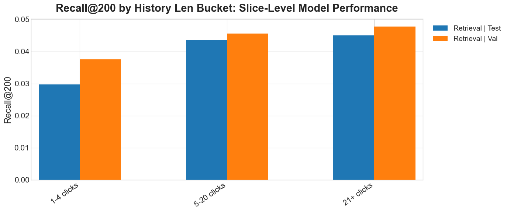
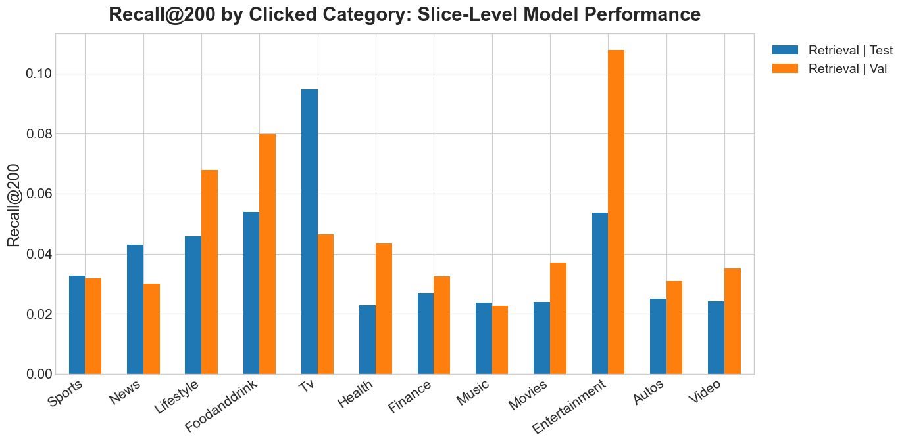
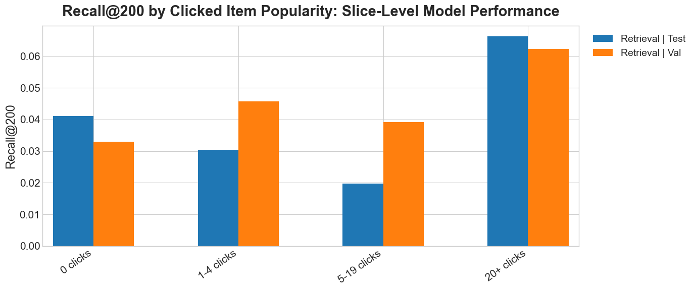
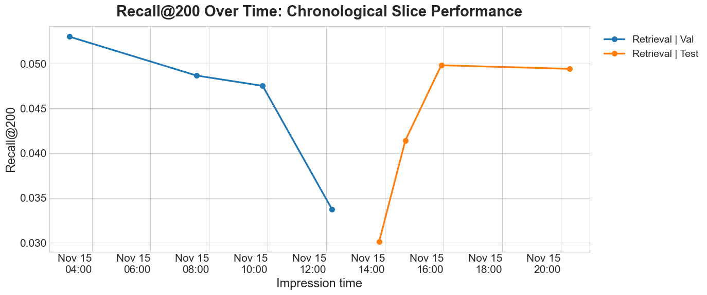

# MIND Multi-Stage News Recommender (Retrieval -> DLRM+Knowledge_Graph Ranker -> Diversity+Coverage+Fairness Re-ranker)

This project implements a realistic recommender stack on the **Microsoft News Dataset (MIND)**:
- Preprocessing: prepare train/val/test data, click-count features, cold/new flags, impression-level eval data, and map IDs to indices.
- Train **Teacher retrieval encoders** (text-based item encoder + history-based user encoder).
- Build two Faiss ANN retrieval indexes: (1) for item embeddings from teacher, and (2) for item-base features. These indexes are used for hybrid candidate retrieval.
- Train **Student ranker**, a lean DLRM-style sparse+dense model that narrows **hybrid retrieval** returned `topk` items to more relevant `pool_size` items. Alongside the usual DLRM-style ID embeddings, category/subcategory embeddings, and dense features, this student uses semantic and **Knowledge Graph embeddings**: it encodes the candidate's text-plus-KG item-base embedding and pools the clicked-history text-plus-KG item-base embeddings. Teacher **distillation** (logit + representation) from the text/history-based teacher helps those semantic branches learn a stronger user/item matching space than click labels alone, **improving cold user/item behavior where ID memorization is weak**.
- **Re-ranking** enforcing a certain degree of item diversity, category/named-entity coverage, and position-weighted exposure fairness for categories/new-items. It further narrows `pool_size` items to `k_out` items.
- Find the best set of reranking weights/penalties given constraints on metrics.
- Extensive **evaluation**: ranking metrics, calibration, diversity, exposure fairness, and cold/new slices.

In production, for each user we have three inference steps:
1. Retrieval narrows millions/thousands of items to `topk=200`
2. Student ranker scores the topk, and narrows down to `pool_size=50`
3. Reranker takes the `pool_size`, and outputs final `k_out=10` items

MIND is widely used as a benchmark for news recommendation, with impression logs and rich news metadata.

Production design note: if a fresh batch of news arrives, for example from the last 15 minutes, the system would need fresh item-side representations. For each new article:
- Run the sentence-transformer over text/title/abstract to produce the text-only retrieval `item_base` embedding.
- Pass the text-only `item_base` through the teacher item encoder to produce `item_teacher_emb`.
- Parse linked Wikidata entities and aggregate entity/relation/one-hop context features to produce the KG-enhanced `item_ranker_base` embedding.
- Mark as cold/new with `is_new_item = 1`, `item_clicks_log1p = 0`.
- Add to both Faiss retrieval indexes: the teacher index (`item_teacher_emb`) and the text-only fallback index (`item_base`).

The current repo/CLI does not implement online index updates; it builds and writes both Faiss indexes in batch via `build_index`.

## Teacher model
- The teacher is a learned two-tower retrieval model:
  - a **news/item encoder** that starts from frozen sentence-transformer news embeddings and applies a trainable projection
  - a **user encoder** that attention-pools clicked-history item embeddings (before the current impression) into a user vector
- In the `behaviors.tsv` dataset, `history` is a list of previously clicked news IDs for that user before the current impression time. It is not a list of previous impressions.
- Training uses clicked positives plus in-impression negatives.
- Retrieval evaluation encodes each validation/test impression with that impression's own user history (not from some later history for the same user), so the query is temporally aligned with the impression being scored.
- `encode_user_from_item_vectors(history_z, mask)` expects:
  - `history_z`: shape `[B, T, D]` where `B` is batch size, `T` is history length, and `D` is the teacher hidden dimension
  - `mask`: shape `[B, T]` with `True` for valid history positions and `False` for padding
  - output: shape `[B, D]`
- Item embedding path:
  - `item_proj`
  - `normalize`
- User embedding path:
  - `item_proj` on each clicked history item
  - `normalize` on each clicked history item
  - `HistoryAttentionPool` (`MultiheadAttention` + learned query)
  - `normalize` on the pooled user vector
- The learned query vector in `HistoryAttentionPool` is a trainable vector used to emphasize certain click history over other click history. This query vector is global, not per-user.
- During teacher training, the trainable parts are:
  - `item_proj`
  - the multi-head attention parameters inside `HistoryAttentionPool`
  - the learned query vector
- The training objective pushes each user vector closer to its clicked positive item and farther from sampled in-impression negatives and other in-batch positives.
- At the end of `train_teacher`, the pipeline writes:
  - `item_base_emb.npy`: frozen text-only sentence-transformer feature for every news item, used by teacher training and retrieval.
  - `item_ranker_base_emb.npy`: separate `[sentence-transformer text embedding ; KG entity/context embedding]` feature used by the student ranker
  - `item_teacher_emb.npy`: the final teacher embedding for every news item
  - `user_teacher_emb.npy`: a cached teacher embedding for each training user history, retained as an artifact for inspection/backward compatibility
- These files are then reused by later stages:
  - `build_index` builds the Faiss retrieval index from `item_teacher_emb.npy`
  - `eval_retrieval` uses `item_teacher_emb.npy` and the saved teacher model to encode held-out histories and search that index
  - `train_ranker` loads `item_ranker_base_emb.npy` as student semantic input and `item_teacher_emb.npy` as item supervision. It does **not** consume `user_teacher_emb.npy`; instead, it dynamically encodes each pair's impression-time history with the saved teacher model.

## Hybrid retrieval scoring

During `eval_retrieval`, the teacher retrieval query is built by taking the impression's clicked history news, looking up their teacher item embeddings, and passing those vectors through `TeacherTwoTower.encode_user_from_item_vectors()`.
The base retrieval query is built by averaging the impression's clicked history news' raw sentence-transformer `item_base_emb.npy` embeddings.

Faiss returns scalar similarity scores:
- `teacher_score`: similarity between the teacher user query and a candidate `item_teacher_emb.npy` vector
- `base_score`: similarity between the averaged of the clicked-history text-only `item_base_emb.npy` vectors and a candidate `item_base_emb.npy` vector

The retrieval code searches both Faiss indexes, merges the oversampled candidate lists, and keeps the final `topk` items by hybrid score. (`hybrid_oversample` controls how many candidates are fetched from each index before the merge.) With the current config, candidates are ranked mostly by teacher retrieval with a small text-only semantic contribution. KG is intentionally not used during retrieval.
```text
hybrid_score = (1 - retrieval.hybrid_base_weight) * teacher_score
             + retrieval.hybrid_base_weight * base_score
```

Retrieval evaluation currently skips users with no history.

History-length slices show how much the retrieval and ranking stages depend on having enough prior clicks to describe the user:




## Student model

The student keeps a lighter semantic core than the teacher, but combines it with classic DLRM signals:
- projected `user_id` / `news_id` branches
- category and subcategory embeddings
- lightweight dense features
- DLRM-style feature interactions

#### DLRM-style semantic additions
- A classic DLRM usually combines sparse ID/category embeddings, dense numerical features, pairwise feature interactions, and a final top MLP. It usually does not include item text embeddings or user-history semantic embeddings directly; those are project-specific additions here.
- In `DLRMStudent`, the candidate item's `item_ranker_base_emb.npy` vector is formed by concatenating its sentence-transformer text embedding with a KG feature vector. That KG vector aggregates the article's linked entity embeddings together with relation-aware one-hop neighbor context from the configured triples file. The candidate item's vector is projected into `item_sem`, and the corresponding clicked-history vectors are pooled/projected into `user_sem`. Both are mapped to the same `emb_dim` length as the other DLRM feature vectors.
- These semantic vectors, plus `sem_fused`, are added to the DLRM feature list as extra feature vectors. They are then included in the pairwise dot-product interaction layer and concatenated into the final top MLP input.

#### Distillation representation
- In `DLRMStudent.forward()`, the student representation used for distillation is `rep = [user_sem, item_sem, sem_fused]`.
- `user_sem`: student semantic user vector from pooled click-history KG-enhanced item-base features
- `item_sem`: student semantic item vector from the candidate item's KG-enhanced item-base feature
- `sem_fused`: a lightweight attention-fusion summary that mixes the semantic user/item states with the structured query context
- The teacher target is `concat(teacher_user_emb, teacher_item_emb)`. A projection head maps the student representation into the teacher space for representation distillation.
- The teacher is semantic/history-based rather than mostly `user_id`/`news_id` memorization. Representation distillation therefore **encourages the student's semantic branch to learn a useful user/item space, especially when ID signals are weak for cold users or new items**.
- If the ranker were trained without distillation, its loss would reduce to the supervised click-label objective:
```python
loss = binary_cross_entropy_with_logits(student_logits, click_label)
```
- Without distillation, retrieval can still be designed in two ways:
  - Use only the frozen text-only `item_base_emb.npy` sentence-transformer embeddings for retrieval
  - Train a retrieval model, but do not use that model as a teacher to supervise the ranker

#### Teacher -> student distillation map
- Distillation in this project is not copying the teacher into a smaller clone.
- The student is trained to imitate the teacher's semantic user/item representations and semantic matching behavior, while still having its additional features.

| Teacher block | What it does | Student replacement | Key difference |
|---|---|---|---|
| Frozen text-only item-base input | Base text semantics for each news item | KG-enhanced `item_ranker_base_emb.npy` input | Retrieval stays text-only; the ranker receives extra entity/relation/neighbor context |
| Teacher semantic item encoder | Refines each item into the teacher semantic space | Smaller student semantic item encoder | Student semantic dimension is much smaller than the teacher space |
| Teacher sequence-aware user encoder | Contextualizes clicked history items with attention before pooling | Cheaper history aggregation path | Student uses a lighter history refinement and aggregation path |
| Teacher attention pooling over history | Builds one semantic user vector from clicked history | Mean-style pooled semantic user path | Student pooling is cheaper and less sequence-aware |
| Teacher item embedding | Semantic representation of the candidate item | `item_sem` | Student item representation is trained to approximate teacher behavior |
| Teacher user embedding | Semantic representation of the current user history | `user_sem` | Student user representation is cheaper to compute |
| Teacher cosine-style user-item scorer | Measures semantic compatibility between user and item | Student top MLP ranker | Student scoring uses richer ranking signals beyond pure semantic similarity |
| Teacher representation target | Provides a semantic supervision target for distillation | `rep = [user_sem, item_sem, sem_fused]` plus projection head | Student and teacher representations have different shapes and meanings |
| No direct teacher counterpart | None | `sem_fused` | Student adds an attention-fusion summary conditioned on query context |
| No direct teacher counterpart | None | `user_id` / `news_id` branches | Student adds collaborative-style memorization signals |
| No direct teacher counterpart | None | category / subcategory embeddings | Student adds structured metadata signals |
| No direct teacher counterpart | None | dense features such as `history_len` and `item_clicks_log1p` | Student adds non-semantic ranking features |
| No direct teacher counterpart | None | DLRM interaction terms + top MLP | Student is a broader ranker, not just a semantic retriever |

Category and clicked-item-popularity slices help check whether the model is robust across content verticals and between new, low-click, and high-click items:







#### Where the student ranker is simplified
- teacher semantic item encoder -> smaller student semantic item encoder
- teacher sequence-aware user encoder -> cheaper history aggregation path
- teacher cosine scorer -> student MLP ranker with many extra inputs

## Re-ranking
- In this project, re-ranking is a **deterministic optimization layer** on top of ranker scores.
- It is controlled by hyperparameters/constraints (relevance, novelty, coverage, fairness).
- **No training loop is required** for this re-ranking stage.

#### Re-ranking process
- `greedy_rerank()` takes the top `pool_size` candidates by ranker score, then builds the final top-`k_out` list one item at a time.
- At each step it scores every remaining candidate with:
- `relevance_weight * relevance`
- `+ novelty_weight * novelty`
- `+ coverage_weight * coverage`
- `- fairness.penalty_weight * fairness_penalty`
- It then picks the candidate with the highest total value, adds it to the list, updates the running novelty/coverage/fairness state, and repeats until `k_out` items are selected.

#### Exposure fairness
- Let `p` be the **actual exposure distribution** of the current ranked list across groups such as categories.
- Let `q` be the **target distribution** we want to match.
- In the current code:
- `p` is built from the selected top-K list after applying position weights.
- `q` is derived from the reference candidate set:
  - `fairness_kl_pool` compares top-K exposure against the reranker's top-`pool_size` candidate mix.
  - `fairness_kl_full` compares top-K exposure against the full impression candidate set.
  - If `category_target: uniform`, then `q` is uniform over categories present in the reference set (not used in this project).
  - If `category_target: catalog`, then `q` is the category distribution of the impression candidate pool (the candidates available for that user/impression), not the selected top-K list and not the global corpus-wide catalog.
- `rerank_eval` and `rerank_search` report both `fairness_kl_pool` and `fairness_kl_full`.
- Product constraints in reranker search use `fairness_kl_pool`, because that matches the reranker's actual optimization target.

#### Worked examples for novelty, coverage, and fairness
- Suppose the reranker has already selected two items: `A` and `B`.
- Candidate `C` has ranker relevance score `0.80`, category `Sports`, entities `{Messi, Inter Miami}`, and is marked as a new item.
- Candidate `D` has relevance score `0.78`, category `Health`, entities `{WHO, vaccine, pandemic, hospital}`, and is not new.

- **Novelty example with `teacher_cosine`**:
  - If `C` has teacher-embedding cosine similarities `0.90` to `A` and `0.35` to `B`, then `novelty(C) = -max(0.90, 0.35) = -0.90`.
  - If `D` has similarities `0.20` to `A` and `0.10` to `B`, then `novelty(D) = -0.20`.
  - Because `-0.20 > -0.90`, `D` is treated as more novel than `C`.

- **Coverage example**:
  - Suppose the selected list has already covered categories `{Sports, Politics}` and entities `{Messi, Real Madrid}`.
  - If `coverage.category_bonus = 1.0`, `coverage.entity_bonus = 0.3`, and `max_new_entities_per_item = 3`:
  - `C` is in `Sports`, which is already covered, so it gets no category bonus. It adds one new entity, `Inter Miami`, so `coverage(C) = 0.3`.
  - `D` is in `Health`, which is new, so it gets `1.0` category bonus. Its four entities are all new, but only the first `max_new_entities_per_item = 3` new entities can contribute, so its entity bonus is `3 * 0.3 = 0.9` and `coverage(D) = 1.9`.

- **Exposure fairness example**:
  - Suppose the current top-3 list has categories `[Sports, Sports, Health]`.
  - With log position weights, a typical exposure pattern is roughly `[1.00, 0.63, 0.50]`.
  - Then the actual category exposure map is:
  - `Sports: 1.00 + 0.63 = 1.63`
  - `Health: 0.50`
  - After normalization, this becomes `p`, the actual exposure share by category.
  - If the reference candidate pool category mix is `Sports: 50%`, `Health: 30%`, `Politics: 20%`, that normalized mix is `q`.
  - The fairness penalty compares `p` and `q` using both KL divergence and L1 distance.

- **New-item exposure penalty example**:
  - Suppose `new_item_floor = 0.20`.
  - If only the rank-3 item is new, then new-item exposure is `0.50`.
  - Total exposure is `1.00 + 0.63 + 0.50 = 2.13`.
  - So `new_item_exposure_frac = 0.50 / 2.13 = 0.235`, which is above the floor, so no extra penalty is added.
  - If no selected item is new, then `new_item_exposure_frac = 0.0`, which is below `0.20`, so the fairness penalty is increased.

## Evaluation
- **Ranking quality**: AUC, MRR, nDCG@K, MAP@K, Recall@K
- **Calibration**: ECE (expected calibration error), Brier score
- **Diversity**: intra-list diversity (ILD), category coverage@K, category entropy@K
- **Exposure fairness**: position-weighted exposure, disparity vs target distribution (KL / L1 / Gini), new-item exposure floor

The official MIND leaderboard reports `AUC`, `MRR`, `nDCG@5`, and `nDCG@10` (see each `ranker_eval_*.json`). The official leaderboard uses the full/large hidden test set. Local metrics are split-dependent, so compare runs only when they use the same validation protocol.

The split protocols and current result locations are tracked in [docs/experiment_registry.md](docs/experiment_registry.md). Check that registry before comparing metrics across runs.

<br>
<br>

# Quickstart

## 0) Hardware target

This repo is designed to run on a powerful Windows laptop:
- uses **faiss-cpu**
- uses a small, strong sentence-transformer as teacher by default (MiniLM family), and caches item embeddings
- supports sub-sampling MIND-large, or using **MIND-small** first

---

## 1) Setup (Windows)

```bash
python -m venv .venv
.venv\Scripts\activate
pip install -r requirements.txt
```

---

## 2) Get the dataset (MIND)

Place files under:
```
data/raw/MINDsmall_train/
data/raw/MINDsmall_dev/
```
Each folder should contain `behaviors.tsv` and `news.tsv`. The reranker may use the entity annotation columns already present in `news.tsv` for coverage when `rerank.coverage.entity_bonus > 0`.
When `knowledge_graph.enabled: true`, the model also needs to use `entity_embedding.vec` and `relation_embedding.vec`.


---

### 2.1) Quick terminology: entities in MIND

- In MIND, an **entity** is a named entity extracted from a news article (person, organization, location, etc.) and linked to a knowledge graph (the MIND paper references Wikidata).
- `entity_embedding.vec`: embedding vector for each entity ID.
- `relation_embedding.vec`: embedding vector for each relation type between entities.
- `WikidataId` is the bridge between `news.tsv` and `entity_embedding.vec`. During the `train_teacher` command, if an article's title or abstract entity annotation contains a `WikidataId`, the KG feature builder looks up the row with that ID in `entity_embedding.vec`.
- A **knowledge-graph triple** is a directed fact written as `(head entity, relation, tail entity)`. For example, `(Q76, P31, Q5)` means that entity `Q76` has relation `P31` to entity `Q5`. In a one-hop lookup, an entity mentioned by an article is the head or tail of a triple, and the entity at the other end is its neighbor.

The implemented approach follows the classic KG recommendation pattern:
- Parse linked `WikidataId` values from each article's title/abstract entity columns.
- Fetch those entity vectors from `entity_embedding.vec`.
- Fetch one-hop neighbors from the required triples file using triples `(entity, relation, entity)`, combine neighbor entity vectors with the relation vector from `relation_embedding.vec`, and aggregate the messages into a context vector.
- Concatenate the final KG vector with the sentence-transformer text vector to form `item_ranker_base_emb.npy`.
- Feed this KG-enhanced item base into the student ranker.

#### Building a triples file

A triples file we can use is **Wikidata5M**, a compact Wikidata-derived KG with the exact ID style this project needs: entities use `Q...`, relations use `P...`, and triples are stored as rows like `Q22686 P39 Q11696`. It is not guaranteed to be the exact MIND TransE training subgraph, but it is a reasonable Wikidata subgraph for one-hop neighbor expansion.

Download one of the Wikidata5M KG files from:
- https://deepgraphlearning.github.io/project/wikidata5m

Then filter it down to MIND-mentioned entities:

```
python scripts/build_mind_wikidata5m_triples.py
  --kg-path path/to/wikidata5m_transductive_train.txt
  --raw-root data/raw
  --train-dir MINDsmall_train
  --dev-dir MINDsmall_dev
  --entity-embedding data/raw/MINDsmall_train/entity_embedding.vec
  --entity-embedding data/raw/MINDsmall_dev/entity_embedding.vec
  --relation-embedding data/raw/MINDsmall_train/relation_embedding.vec
  --relation-embedding data/raw/MINDsmall_dev/relation_embedding.vec
  --output data/processed/MINDsmall/kg_triples.tsv
```

How this repo uses MIND entity annotations:
- `news.tsv` contains `title_entities` and `abstract_entities` columns.
- During greedy reranking, the reranker tracks covered entities for the entity coverage bonus.
- Reranker entity coverage is separate from the neural KG feature path: coverage decides list diversity, while KG features affect the learned ranker representation.

#### Rejected KG retrieval experiments

KG is kept in the downstream ranker because the retrieval-stage KG experiments did not generalize reliably:

1. **Full-strength KG in retrieval/item base** concatenated a strongly weighted KG vector with the text vector used by the teacher and base retrieval index. This allowed entity embeddings, one-hop neighbors, and relation messages to directly influence nearest-neighbor retrieval.
2. **Weakened KG in retrieval** kept the same text-plus-KG retrieval design but reduced the KG, neighbor, and relation weights so text remained the dominant retrieval signal.
3. **Reserved KG candidate slots** generated candidates from entities and their one-hop neighbors, then forced a fixed quota of those candidates into the final top-`K` retrieval set.
4. **KG-aware retrieval score bonus** left candidate generation unchanged, but added a small score bonus to candidates whose linked entities matched or neighbored entities found in the user's clicked history.

The accepted design is therefore **text-only retrieval plus a KG-enhanced ranker**.

---

### 2.2) What `run_preprocess()` does

`run_preprocess()` converts raw MIND TSV files into model-ready parquet/json files.

Main steps for temporal-tune configs such as `configs/mind_small_temporal_tune.yaml`:
- Read `news.tsv` and `behaviors.tsv` from train/dev.
- Build ID mappings (`user_id/news_id/category/subcategory -> integer index`).
- Move the final day of `train_dir` into validation, then append all of `dev_dir` to that same validation split.
- Build held-out pairwise rows (`val_pairs.parquet`). Persist `train_pairs.parquet`
  only when hard-negative sampling is disabled.
- Build impression-level validation data (`val_impressions.parquet`).

How pairs are created:
- For an impression with `P` positives and `N` negatives, `P * (1 + min(data.ranker_negatives_per_positive, N))` pairs are generated.
- Each positive is paired with up to `data.ranker_negatives_per_positive` sampled negatives; the current config uses `4`.
- These negatives are labeled non-clicked candidates from the same impression.
  This is the fallback ranker pair-building behavior when hard-negative sampling is disabled.
- With `ranker.hard_negative_sampling.enabled: true`, ranker training rebuilds a larger
  same-impression pool from `train_behaviors.parquet`. The teacher scores every pooled
  candidate against that impression's history. The student then trains on a configurable
  mix of teacher-hard and random non-clicked candidates. Preprocessing skips the unused
  `train_pairs.parquet` artifact in this mode.
- The default hard-negative settings retain 4 negatives from a pool of up to 20:
  1 teacher-hard negative and 3 random negatives for groups with a usable history.
- Groups with no usable encoded history bypass teacher scoring and retain 4 random
  same-impression negatives. A zero-history teacher vector cannot distinguish candidates,
  so labeling one of those negatives as hard would be arbitrary.
- To avoid teacher/student label conflict, teacher-hard candidates are only selected from
  negatives that the teacher scores no higher than the clicked positive in the same
  impression. Distillation is also disabled on teacher-mined hard-negative rows by
  default; random negatives still use the normal distillation objective.
- Set `ranker.hard_negative_sampling.hard_for_cold_users_only: true` to restrict
  hard-negative mining to users with fewer than `data.min_user_hist_for_warm` history
  items and at least one usable encoded history item. With the default warm threshold of
  5, users with 1-4 history items receive the hard/random mixture; zero-history and warm
  users keep the same number of negatives, but all of them are random same-impression
  negatives. The implementation skips teacher scoring for all random-only groups.

What about the negative sampling for teacher?
- `teacher.negatives_per_positive` controls the contrastive sample of the teacher retriever.
- The current config uses `8`, so each clicked item can be paired with up to 8 non-clicked candidates from the same impression when training the teacher. If an impression only has 5 negatives, it uses 5.
- Samples are generated in-memory and independently from ranker pair construction.

Why there is no `train_impressions.parquet`:
- Ranker training uses pairwise rows, either persisted in `train_pairs.parquet` for random
  sampling or built dynamically from `train_behaviors.parquet` for hard mining.
- Impression-grouped data is mainly needed for ranking evaluation, so temporal-tune configs only generate it for `val`.

Validation split note:
- Training, early stopping, and calibration use `val`.
- `eval_retrieval` and `evaluate` report every split listed in `eval.report_splits`; temporal-tune configs report only `val`.
- Large hidden test scoring is handled by `configs/mind_large_submission.yaml` and `write_submission`.
- The older `configs/mind_small.yaml` still supports the previous Small `val`/`test` demo flow, but architecture experiments should use the temporal config.

The evaluation JSONs also split each evaluated holdout window into chronological `time_period__...` slices, so regressions can be checked against the actual temporal order of impressions:




Temporal MINDsmall raw split sizes:
- Training before Nov 14 from `MINDsmall_train`: `126,695` impressions
- Nov 14 tail moved from `MINDsmall_train` to validation: `30,270` impressions
- Official `MINDsmall_dev` appended to validation: `73,152` impressions
- Combined validation: `103,422` impressions

---

## 3) End-to-end

### 3.1 Preprocess TSV -> Parquet + feature maps
```powershell
python -m mindrec.cli preprocess --config configs/mind_small_temporal_tune.yaml
```

### 3.2 Train teacher retriever + build ANN index
```powershell
python -m mindrec.cli train_teacher --config configs/mind_small_temporal_tune.yaml
python -m mindrec.cli build_index --config configs/mind_small_temporal_tune.yaml
python -m mindrec.cli eval_retrieval --config configs/mind_small_temporal_tune.yaml
python -m mindrec.cli eval_retrieval_sweep --config configs/mind_small_temporal_tune.yaml
```

With the temporal Small config, `eval_retrieval` writes:
- `runs/<run_name>/retrieval/eval_val.json`

The retrieval evaluation includes additional slice families:
- chronological `time_period__...` slices within each evaluated split
- `history_len_bucket__...` slices
- `impressions_with_clicked_popularity_bucket__...` slices
- `impressions_with_clicked_category__...` slices
- `impressions_with_clicked_subcategory__...` slices

`eval_retrieval_sweep` evaluates the hybrid grid defined in `retrieval.sweep`:
- `hybrid_base_weights: [0.05, 0.0625, 0.075]`
- `hybrid_oversamples: [18, 22, 26]`

It writes `runs/<run_name>/retrieval/sweep.json` with all tested settings plus the best one by held-out `recall@K`.

### 3.3 Train student DLRM ranker with distillation
```powershell
python -m mindrec.cli train_ranker --config configs/mind_small_temporal_tune.yaml
```

When hard-negative sampling is enabled, `train_ranker` uses the persisted training
behaviors to build a larger negative pool, scores it once with the trained teacher, and
keeps the configured hard/random mixture. Teacher-mined hard negatives are tagged in the
temporary training rows so their distillation weight can be reduced independently from
ordinary random negatives. The optional `hard_for_cold_users_only` setting applies that
hard/random mixture only to cold users with a usable history; zero-history users always
receive random negatives because their teacher candidate scores tie. Set
`ranker.hard_negative_sampling.enabled: false` to train on the original
`train_pairs.parquet` random sample. Mining statistics are written under
`hard_negative_sampling` in `ranker/train_summary.json`.

After training, `train_ranker` fits a temperature scaler on the unchanged
`val_pairs.parquet`. It tunes a single positive scalar `T` in
`sigmoid(logit / T)` against held-out labels, improving probability **calibration**
without changing ranking order.

For the Small temporal ranker learning-rate sweep:
```powershell
python -m mindrec.cli train_ranker_lr_sweep --config configs/mind_small_temporal_tune.yaml
```

This uses `ranker.lr_sweep.lrs` and writes isolated variant runs such as `runs/mind_small_temporal_tune_ranker_lr_1em03`. The combined summary is written to `runs/mind_small_temporal_tune/tuning/ranker_lr_sweep/sweep.json`.

### 3.4 Evaluate ranker + reranker (metrics + slices)
```powershell
python -m mindrec.cli evaluate --config configs/mind_small_temporal_tune.yaml
```

With the temporal Small config, `evaluate` writes:
- `runs/<run_name>/eval/ranker_eval_val.json`

The ranker evaluation includes additional slice families:
- chronological `time_period__...` slices within each evaluated split
- `history_len_bucket__...` slices
- `impressions_with_clicked_new_item` and `impressions_with_clicked_warm_item`
- `impressions_with_clicked_popularity_bucket__...` slices
- `impressions_with_clicked_category__...` slices
- `impressions_with_clicked_subcategory__...` slices

For new/cold item ranking evaluation, each impression contains many candidate items, and ranking metrics are calculated for the whole impression. Therefore `impressions_with_clicked_new_item` means: evaluate whole impressions where at least one clicked positive item is new. It does not mean evaluating only the new candidate items inside all impressions.

### 3.5 Build a MIND-large leaderboard submission
Use four MIND-large configs:
- `configs/mind_large_temporal_baseline.yaml`: reproducible random-negative baseline. It
  trains on `MINDlarge_train` before Nov 14, then validates on Nov 14 from
  `MINDlarge_train` plus all of `MINDlarge_dev`.
- `configs/mind_large_temporal_tune.yaml`: hard-negative v4 experiment on the same
  temporal split. It reuses the baseline teacher and mines hard negatives only for cold
  users with usable history.
- `configs/mind_large_tune.yaml`: official train-to-dev model-selection run, with all `MINDlarge_train` for training and `MINDlarge_dev` for validation.
- `configs/mind_large_submission.yaml`: hard-negative v4 final submission run, with
  `MINDlarge_train + MINDlarge_dev` for fixed-epoch training and `MINDlarge_test` for
  hidden-test scoring.

If `knowledge_graph.enabled: true`, first build the Large KG triples file:
```powershell
python scripts/build_mind_wikidata5m_triples.py `
  --kg-path data/raw/wikidata5m/wikidata5m_transductive_train.txt `
  --entity-embedding data/raw/MINDlarge_train/entity_embedding.vec `
  --entity-embedding data/raw/MINDlarge_dev/entity_embedding.vec `
  --entity-embedding data/raw/MINDlarge_test/entity_embedding.vec `
  --output data/processed/MINDlarge/kg_triples.tsv
```

First build the temporal baseline for future experiments:
```powershell
python -m mindrec.cli preprocess --config configs/mind_large_temporal_baseline.yaml
python -m mindrec.cli train_teacher --config configs/mind_large_temporal_baseline.yaml
python -m mindrec.cli train_ranker --config configs/mind_large_temporal_baseline.yaml
python -m mindrec.cli evaluate --config configs/mind_large_temporal_baseline.yaml
```

Inspect:
- `data/processed/MINDlarge_temporal_tune/preprocess_meta.json`
- `runs/mind_large_temporal_tune/teacher/meta.json`
- `runs/mind_large_temporal_tune/ranker/train_summary.json`
- `runs/mind_large_temporal_tune/eval/ranker_eval_val.json`

For temporal configs, the evaluation row count in `ranker_eval_val.json` should match `n_validation_eval_impressions` in `preprocess_meta.json`. If it does not, rerun `evaluate` with the current code before using the metrics as a baseline.

Latest completed Large temporal baseline:

| Validation impressions | Teacher best epoch | Ranker best epoch | AUC | MRR | nDCG@5 | nDCG@10 |
| ---: | ---: | ---: | ---: | ---: | ---: | ---: |
| 807,988 | 4 | 1 | 0.646597 | 0.304210 | 0.330920 | 0.393785 |

This run trains on `MINDlarge_train` impressions before Nov 14 and evaluates the full
validation window formed from the Nov 14 tail of `MINDlarge_train` plus all of
`MINDlarge_dev` on Nov 15. The teacher stopped at epoch 6 and selected epoch 4;
the ranker stopped at epoch 3 and selected epoch 1. The table reports full
impression-ranking metrics from `ranker_eval_val.json`; the ranker's sampled-pair
early-stopping AUC is a different quantity.

Current baseline metrics are recorded in [docs/experiment_registry.md](docs/experiment_registry.md).

Latest completed hard-negative v4 result on the same 807,988 validation impressions:

| AUC | MRR | nDCG@5 | nDCG@10 |
| ---: | ---: | ---: | ---: |
| 0.645785 | 0.305195 | 0.332726 | 0.394743 |

V4 uses `configs/mind_large_temporal_tune.yaml`. Its zero-history groups use 4 random
negatives; cold users with usable history use 1 teacher-hard plus 3 random negatives.

Then copy the selected fixed epoch counts into `configs/mind_large_submission.yaml`:
- `teacher.epochs`: selected teacher `best_epoch`
- `ranker.epochs`: selected ranker `best_epoch`

For the completed baseline above, use `teacher.epochs: 4` and `ranker.epochs: 1`.

The final submission config disables early stopping and calibration because no labeled validation split is held out in the final fit. Then run:
```powershell
python -m mindrec.cli preprocess --config configs/mind_large_submission.yaml
python -m mindrec.cli train_teacher --config configs/mind_large_submission.yaml
python -m mindrec.cli train_ranker --config configs/mind_large_submission.yaml
python -m mindrec.cli write_submission --config configs/mind_large_submission.yaml
```

The submission command does not use the reranker. It writes:
- `runs/mind_large_submission_hard_neg_v4/submission/prediction.txt`
- `runs/mind_large_submission_hard_neg_v4/submission/prediction.zip`

By default, it streams the hidden test file and does not write a large scores parquet.
Set `submission.save_scores: true` only if you explicitly want
`runs/mind_large_submission_hard_neg_v4/submission/submission_test_scores.parquet`
for debugging.

The official MIND evaluator reads `prediction.txt` lines as `impression_id [rank,...]`, where rank `1` is the highest-scored candidate. Local MIND metrics report AUC, MRR, nDCG@5, and nDCG@10 using the same per-impression ranking definitions as the official evaluator; leaderboard rank is primarily by AUC.

### 3.6 Fixed recency tiebreaker (`alpha=0.02`)

This keeps the 0.6721 baseline ranker frozen, standardizes its scores within
each impression, and adds `0.02 * freshness_percentile`. Build the label-free
first-seen-time index once, then write the submission:

```powershell
python -m mindrec.cli train_ranker --config configs/mind_large_submission.yaml
python -m mindrec.cli build_item_age --config configs/mind_large_submission_recency_alpha_002.yaml
python -m mindrec.cli write_submission --config configs/mind_large_submission_recency_alpha_002.yaml
```

Large Test AUC was **0.6724**. The output is
`runs/mind_large_submission_recency_alpha_002_v1/submission/prediction.zip`.

#### Failed trend experiments

| Experiment | Result | Decision |
|---|---:|---|
| Item exposure burst + age features | 0.6518 Large Test | Removed |
| Learned age-residual branch | 0.6679 Large Test | Removed |
| Recency `alpha=0.03` | 0.6723 Large Test | Removed; keep `0.02` |
| Semantic-neighborhood burst | Temporal tuning selected zero | Removed |
| Content trend propensity | 0.6722 Large Test | Removed |
| Conservative content tiebreaker grids | Guardrails selected zero | Removed |

### 3.7 Search reranker hyperparameters under a product constraint
Reranking is not used by the leaderboard submission path, but the search workflow is still available for product-style ranking experiments:
```powershell
python -m mindrec.cli rerank_search --config configs/mind_small_temporal_tune.yaml
```

The reranking score and scalar utility are used at different levels:
- The reranking score answers: with this fixed hyperparameter setting, which candidate item should be placed next in this user's top-`k_out` list?
- `scalar_utility` answers: after evaluating a full candidate setting, which hyperparameter setting gives the best product tradeoff under the predetermined utility coefficients?

In practice, it is usually easier for business/product stakeholders to decide global scalar utility coefficients or guardrails than local reranker weights. That is why we search the local reranker hyperparameters instead of determine them.

Before searching for the best local reranker weights/penalties, we need to determine the following values that define the search problem:
- `coverage.category_bonus`, `coverage.entity_bonus`
- Guardrail thresholds: acceptable nDCG drop, required coverage gain, required fairness improvement, and new-item exposure constraint
- Utility coefficients: the relative importance of retained relevance, new-item exposure, category coverage, and fairness improvement when ranking candidate settings
- A practical workflow to determine these values is:
1. Set the maximum acceptable nDCG drop.
2. Agree on guardrails (minimum improvements) for the other metrics by reviewing mocked or held-out impressions and feeling what the metric changes look like.
3. Review sample impressions as baseline list vs. reranked list to choose utility coefficients/weights:
  - Did the list feel repetitive?
  - Did new items appear in reasonable positions?
  - Did relevance visibly degrade?
  - Did category coverage feel diverse but relevant, or completely random?

The scalar utility is computed from baseline-relative **normalized** units:
- `ndcg_retention_units = 1 - relative_ndcg_drop`
- `new_item_exposure_gain_units = new_item_exposure_gain`
- `category_coverage_gain_units = category_coverage_gain / min_category_coverage_gain`
- `fairness_kl_pool_improvement_units = fairness_kl_pool_improvement / min_fairness_kl_pool_improvement`

with coefficients:
- `4.0 * ndcg_retention_units`
- `0.5 * new_item_exposure_gain_units`
- `1.5 * category_coverage_gain_units`
- `1.5 * fairness_kl_pool_improvement_units`

The search uses baseline-relative guardrails. We need guardrails because guardrails define what "acceptable" means, and then we can choose the setting with the highest utility among acceptable tradeoffs. Also, if the coefficients underweight relevance or overweight coverage/fairness, then a setting can look "best" by utility while still being a bad product choice; guardrails can prevent that. Current guardrails:
- `nDCG@10` drop must be at most `2.1%` relative to the baseline ranker (initially 2%; changed to 2.1% to allow a good hyperparameter set).
- `new_item_exposure_frac` must not decrease relative to baseline.
- `category_coverage@10` must improve by at least `0.25`.
- `fairness_kl_pool` must improve by at least `0.04`.

Typical workflow:
- run `rerank_search`
- inspect `best_feasible` or another chosen operating point in `rerank_search.json`
- update the active experiment config with the selected rerank parameters
- rerun `rerank_search` or a dedicated reranker report on the same temporal validation split

The current reranker search reports three views of the tradeoff surface on validation:
- `best_feasible`: maximize scalar utility among settings that satisfy the guardrails
- `best_scalar_utility`: maximize a normalized scalar utility
- `pareto_frontier`: nondominated settings across ranking/diversity/fairness axes

`rerank_search` evaluates candidates in two passes:
- First pass: fast screening. All candidate settings in the search grid are evaluated on a sample of up to 500 validation impressions.
- Second pass: full validation. Only a shortlist of promising candidates is evaluated on the full validation split.
- `pareto_frontier.md` is written from the full-pass shortlisted results, not from every sample-screened candidate.

The current selected setting is:
- `relevance_weight=0.875`
- `novelty_weight=0.05`
- `coverage_weight=0.075`
- `novelty_sim=teacher_cosine`
- `fairness.penalty_weight=0.25`
- `fairness.new_item_floor=0.20`

The search writes its summary to `runs/<run_name>/eval/rerank_search.json`.

Artifacts go to `runs/<run_name>/`.
Training logs are written to `runs/<run_name>/teacher/epochs.json` and `runs/<run_name>/ranker/epochs.json`.

### 3.8 Historical demo results (`runs/mind_small_demo`)

Teacher retrieval:
- Historical retrieval setup was text-only hybrid retrieval:
  - teacher retrieval from `item_teacher_emb.npy`
  - text-only item-base fallback from `item_base_emb.npy`
  - KG is not used by the teacher or retrieval indexes
  - `teacher.text.include_category_prefix = false`
  - `hybrid_base_weight = 0.075`
  - `hybrid_oversample = 26`
- Teacher retrieval validation `Recall@200 = 0.044892`
- Teacher retrieval test `Recall@200 = 0.042396`
- Early stopping monitor: `retrieval_recall@200`
- Best teacher epoch: `2`
- Rejected experiment: adding category/subcategory prefixes to the teacher text input improved Teacher retrieval validation `Recall@200`, but hurt downstream Student ranker quality, so the default remains `teacher.text.include_category_prefix = false`.

Student ranker:
- Historical semantic input was `item_ranker_base_emb.npy`, a `484`-dimensional text-plus-KG vector:
  - text dimension: `384`
  - KG dimension: `100`
  - `knowledge_graph.enabled = true`
  - the teacher and retrieval indexes remain text-only
- Historical semantic settings:
  - `semantic_ff_mult=3`
  - `semantic_dropout=0.20`
  - `dropout=0.15`
  - `weight_decay=3.0e-5`
  - `news_id_warm_scale=1.0`
  - `news_id_cold_scale=0.0`
- The `news_id_*_scale` settings control only the learned `news_id` embedding branch in the DLRM ranker.
  Warm items keep their ID embedding contribution, while **new/cold items get that branch zeroed out** and are scored relying on semantic, category/subcategory, user, and dense features instead.
  new/cold items are found during preprocessing from training (click counts under the `min_item_train_clicks_for_warm` limit).
- Best ranker epoch: `5`
- Student ranker validation:
  - `AUC = 0.662502`
  - `MRR = 0.371160`
  - `nDCG@5 = 0.356072`
  - `nDCG@10 = 0.419516`
  - `Recall@10 = 0.685537`
- Student ranker test:
  - `AUC = 0.661939`
  - `MRR = 0.358905`
  - `nDCG@5 = 0.346308`
  - `nDCG@10 = 0.405037`
  - `Recall@10 = 0.656618`
- calibration on test changed:
  - `Brier: 0.138993 -> 0.073153`
  - `ECE@15: 0.314986 -> 0.174863`

Search summary:
- `best_feasible` is the setting that has the highest-utility and is also feasible
- Historical validation baseline ranker before reranking:
  - `nDCG@10 = 0.419516`
  - `Recall@10 = 0.685537`
  - `category_coverage@10 = 5.341723`
  - `fairness_kl_pool = 0.418917`
  - `new_item_exposure_frac = 0.560894`
- Historical validation `best_feasible`:
  - `nDCG@10 = 0.411298`
  - `Recall@10 = 0.674537`
  - `category_coverage@10 = 6.059363`
  - `fairness_kl_pool = 0.317624`
  - `new_item_exposure_frac = 0.576442`
  - relative `nDCG@10` drop: `1.959%`
- `n_feasible = 16` under the current guardrails
- `best_scalar_utility` is a more aggressive diversity/fairness point, but it is not feasible under the current guardrails

Final reranker test report:
- Baseline ranker:
  - `nDCG@10 = 0.405037`
  - `Recall@10 = 0.656618`
  - `category_coverage@10 = 5.140319`
  - `fairness_kl_pool = 0.421459`
  - `new_item_exposure_frac = 0.774352`
- Reranked output:
  - `nDCG@10 = 0.396905`
  - `Recall@10 = 0.646227`
  - `category_coverage@10 = 5.999590`
  - `fairness_kl_pool = 0.295704`
  - `new_item_exposure_frac = 0.786196`
- The reranker trades approximately `2.01%` relative `nDCG@10` for better category coverage, fairness KL, and new-item exposure.

---

## 4) Repo layout

- `src/mindrec/`
  - `data/`: parsing + feature building
  - `models/teacher.py`: teacher-side embedding utilities
  - `models/dlrm.py`: student DLRM ranker + attention fusion
  - `rerank/`: diversity + coverage + exposure fairness reranking
  - `metrics/`: ranking, calibration, diversity, fairness
  - `cli.py`: entrypoint for scripts
- `configs/`: YAML configs
